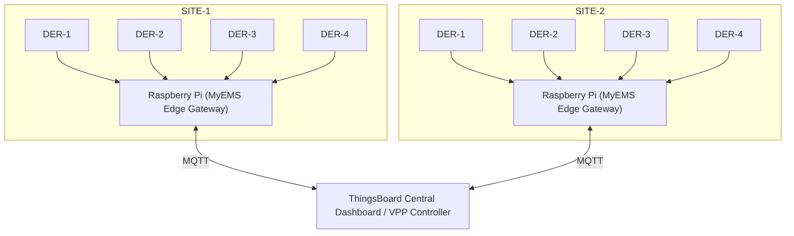

# System Architecture: Distributed VPP for Commercial Real Estate

This is a modular architecture bridging local operational control (Edge) and centralized grid intelligence (Cloud).

## 1. Edge Layer: Site-Level Management (MyEMS)
Each site (mall/office park) has a Raspberry Pi Gateway as an Intelligent Edge Node.

- **Service layer:** local MyEMS (CE) manages energy data lifecycle.
- **DER integration:** solar PV, batteries, HVAC via Modbus-TCP and industrial protocols.
- **Operational logic:** real-time business logic, site reporting, local dashboards.
- **Resilience:** site remains functional if cloud connectivity is interrupted.

## 2. Communication Layer: Data Orchestration (MQTT)
Each MyEMS instance wrapped with an MQTT post service.

- **Payload:** structured JSON telemetry + DER status.
- **Security:** secure, async transmission edge → cloud.

## 3. Cloud Layer: Centralized Command Center (ThingsBoard CE)
ThingsBoard (CE) acts as the VPP “brain”.

- **Asset hierarchy:** Telemetry → Site Node → Asset Group → National VPP
- **Aggregation:** real-time calculations to derive total system capacity.

## 4. Control Logic: Grid-Responsive Optimization
Demand response + optimization algorithm:

- **Threshold monitoring:** compare VPP capacity vs live national grid demand/load.
- **Automated dispatch:** on critical threshold, trigger optimization event.
- **Downstream control:** send commands back to edge to discharge batteries or shed non-critical loads.

## 5. Roadmap
- **Staging (current):** demand-side management + internal optimization (reduce bills, reduce strain).
- **Pro version:** bi-directional energy flow + net metering / P2P trading marketplace.

## 6. Graphical design (multi-site VPP topology)

